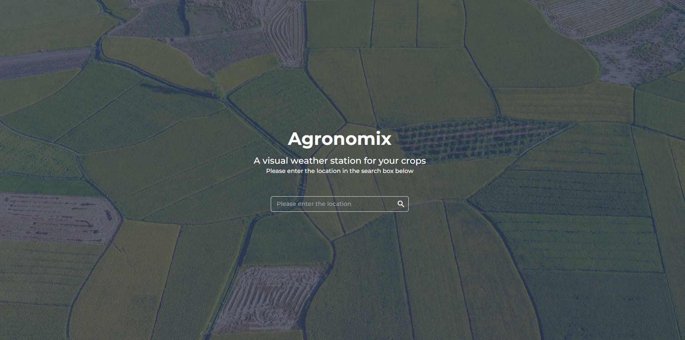

# Agronomix

## Introduction
Agronomix is a web application dedicated to providing farmers and other stakeholders with valuable data on lists of location, weather conditions, and additional relevant metrics. 

The main goal of this dashboard is to assist farmers and stakeholders in making data-driven decisions for their agricultural activities.

## Screenshot

## Features
- Agricultural Area Insights: The dashboard utilizes the Agromonitoring API to create polygons and retrieve data lists showcasing insights about different agricultural regions.
- Weather Conditions: Users can access real-time weather information to stay informed about the current climate in their farming regions.
- Location Data: The LocationIQ API is integrated to fetch latitude and longitude information for precise location tracking.

## Technologies Used

Agronomix utilizes the following technologies:

- HTML, CSS, JavaScript: For building the front-end user interface and interactions.
- Tailwind CSS: Used for responsive styling and utility classes.
- Agromonitoring API: Used to generate polygons and fetch their data.
- LocationIQ API: Used to obtain latitude and longitude information.

## Contributing
We welcome contributions from the open-source community. Feel free to fork this repository and submit your pull requests.

## License
This project is licensed under the [MIT License](LICENSE).